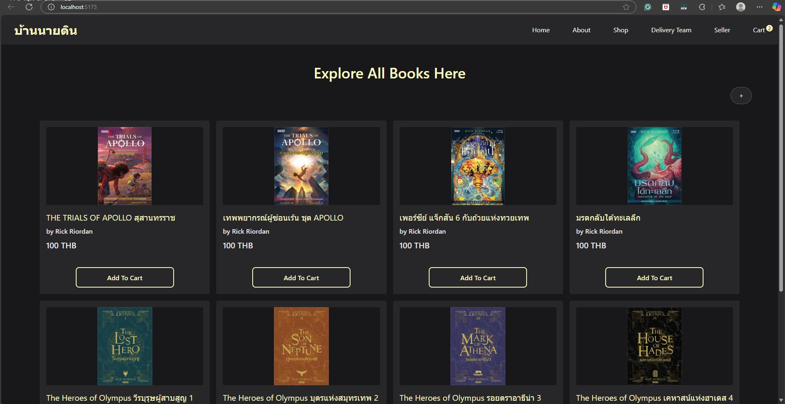
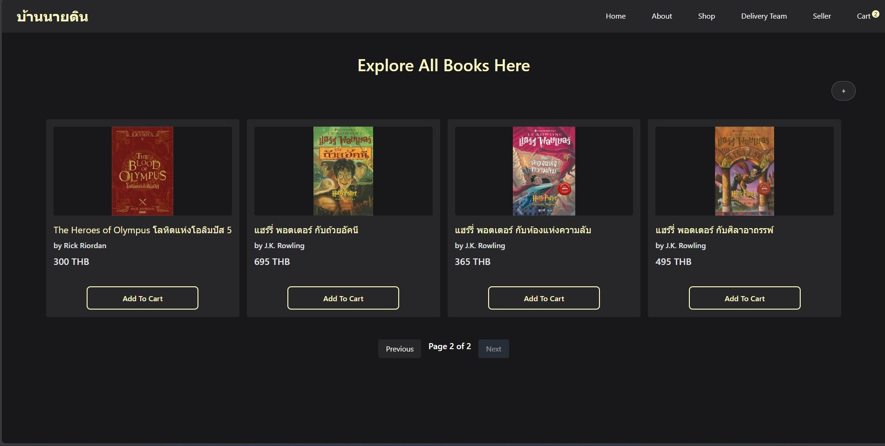
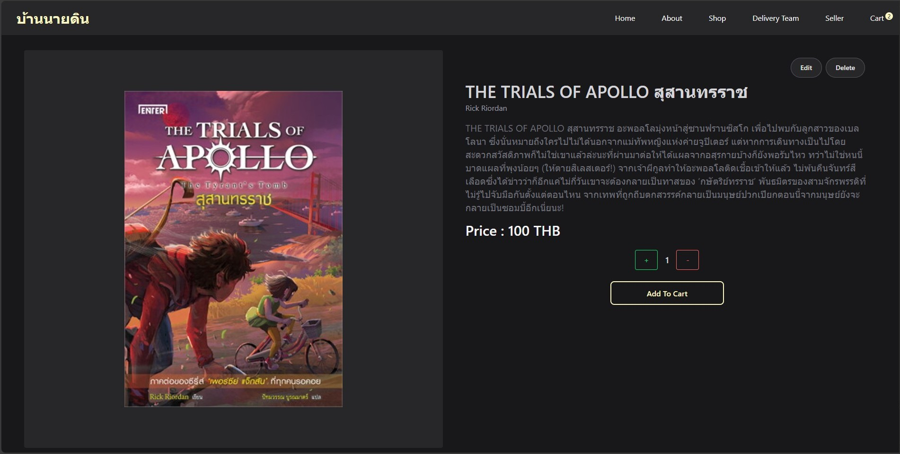
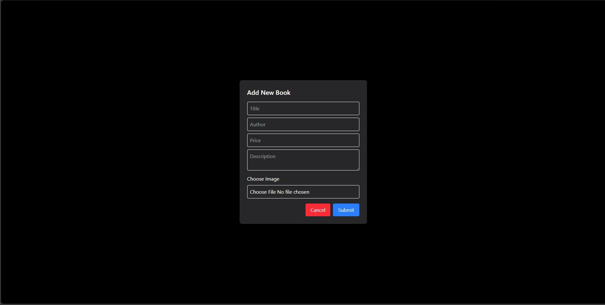
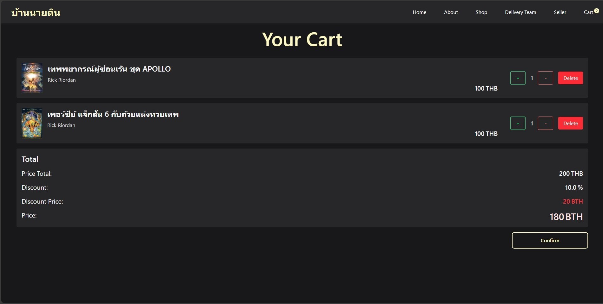
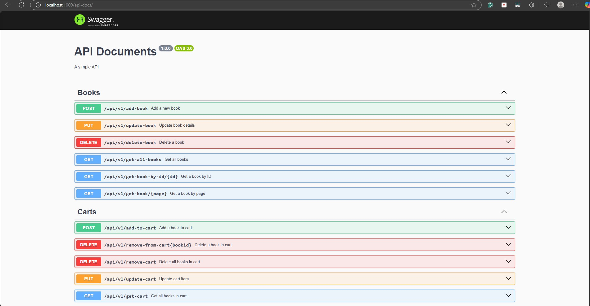

# 📚 Quiz Web Application

A simple web application for managing books with features like adding, editing, deleting, and viewing book details. This project also includes a shopping cart and API documentation using Swagger.

## 🌟 Features
✅ View books with pagination 

✅ Add, edit, and delete books  

✅ View detailed information about a book  

✅ CRUD book

✅ Add book and quantity to cart 

✅ Shopping cart functionality 
 
✅ API documentation with Swagger  

---

## 🖥️ UI Preview

### 🏠 Home Page
Displays the list of available books with pagination.



### 📑 Home Page (Pagination)
Navigate through the book collection with pagination.



### 📖 Book Details
View complete details of a book.



### ➕ Add a Book
Add a new book using the form.



### ✏️ Edit a Book
Modify book details with the edit form.


### ❌ Delete a Book
Remove a book by pressing the **Delete** button.


### 🛒 Shopping Cart
Manage books in the cart.



### 📜 API Documentation (Swagger)
Explore API endpoints using Swagger.



---

## 🚀 Installation & Setup
Follow these steps to run the project locally:

1. Clone the repository:
   ```sh
   git clone https://github.com/TIPPATAI-KONGPAYUNG/Quiz.git
